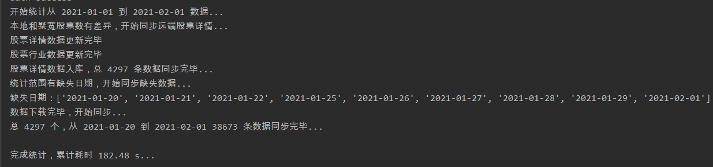
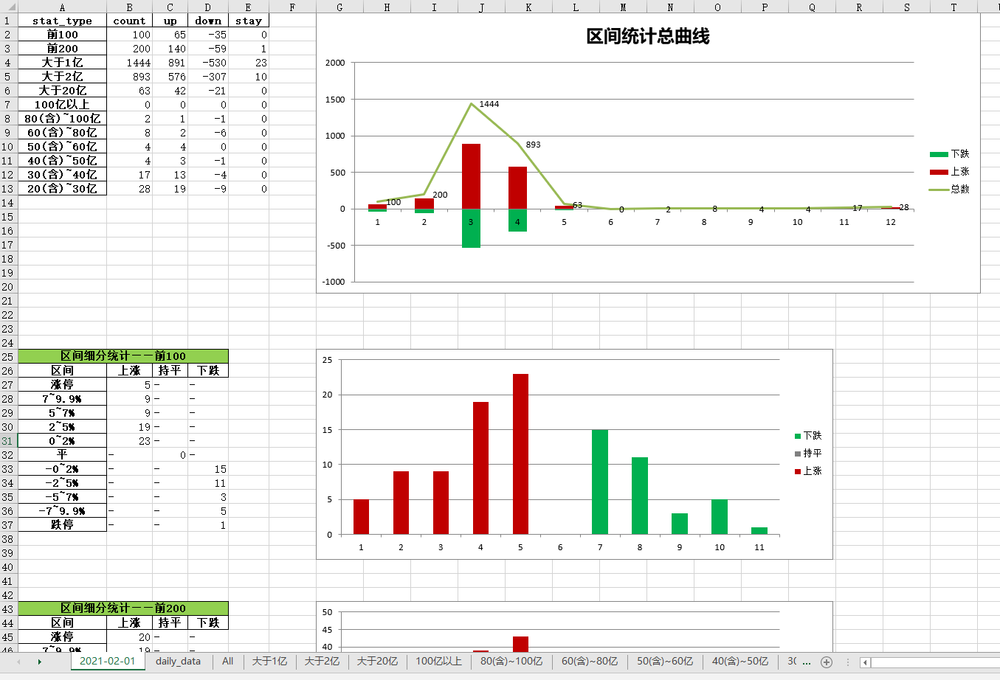

# jq_stock

## 架构
+ 主框架
    + jq_dataManage.py：与聚宽交互部分逻辑，比如从聚宽下载/更新数据
    + clean_data.py：原始数据清洗/入库等逻辑，比如每日统计数据入库、股票行业数据清洗
    + orm_sqlite.py ：数据模型类，本工具ORM使用peewee
    + statistics_data.py：统计分析（最终目的）
+ 其他：
    + 通用常用数据文件，一般使用json文件格式保存：比如，股票详情基础数据、行业数据等
    + jq_database.db：轻SQL数据库文件

## 一键统计数据
### 一键完成数据补充、清洗、统计、数据导出和结果可视化等功能：main_stat.py
``` 
if __name__ == '__main__':
    """统计汇总，只需跑一次该脚本即可"""
    start_date = "2021-01-01"
    end_date = "2021-02-01"
    main(start_date, end_date)
```
### 结果展示




